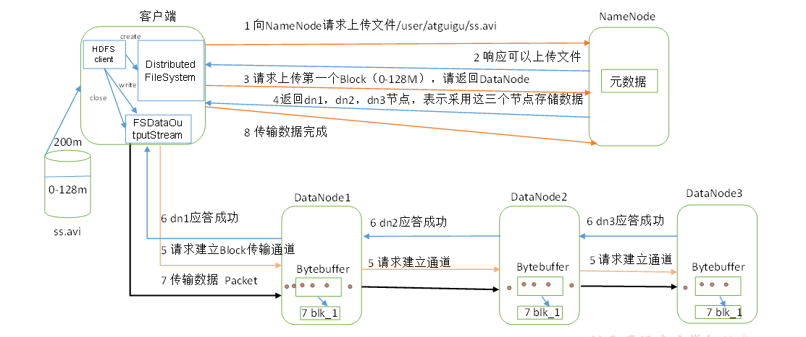
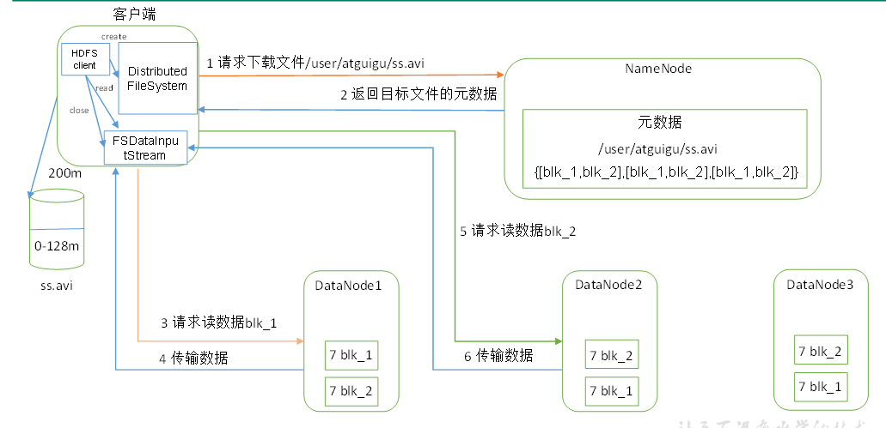
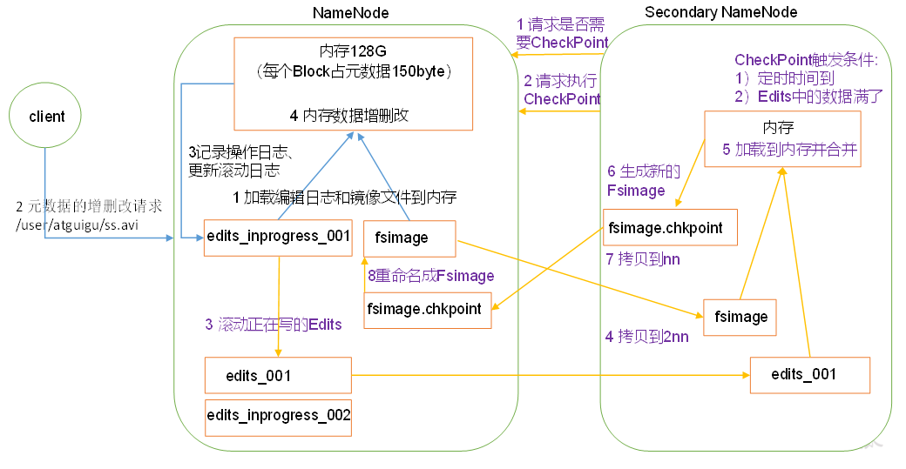
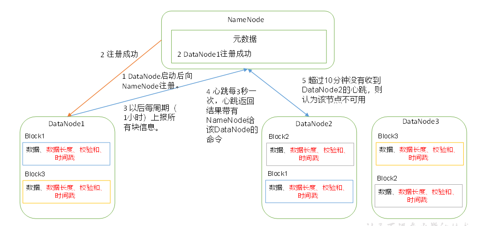
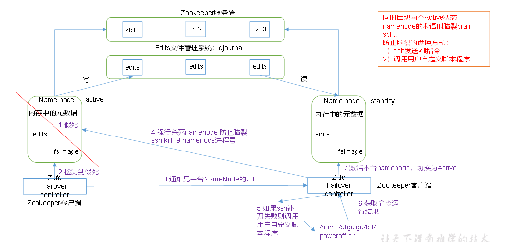

## hdfs写入数据流程

## hdfs读取数据流程

## NameNode和SecondaryNameNode工作原理

 1. 启动NameNode
    - 首次启动NameNode格式化后，创建FsImage和Edits文件。非首次启动则会加载FsImage和Edits到内存中
    - client对元数据进行增删改操作
    - NameNode记录操作日志，更新Edits
    - NameNode在内存中对元数据进行增删改
 2. SecondaryNameNode开始工作
    - SecondaryNameNode询问NameNode是否需要CheckPoint。直接带回NameNode是否检查结果。
    - Secondary NameNode请求执行CheckPoint。
    - NameNode滚动正在写的Edits日志。
    - 将滚动前的编辑日志和镜像文件拷贝到Secondary NameNode。
    - Secondary NameNode加载编辑日志和镜像文件到内存，并合并。
    - 生成新的镜像文件fsimage.chkpoint。
    - 拷贝fsimage.chkpoint到NameNode。
    - NameNode将fsimage.chkpoint重新命名成fsimage。
    
> FsImage: NameNode内存中元数据序列化后形成的文件。
>
> Edits: 记录客户端更新元数据信息的每一步操作（可通过Edits运算出元数据）。

## DataNode工作机制

## HDFS HA

